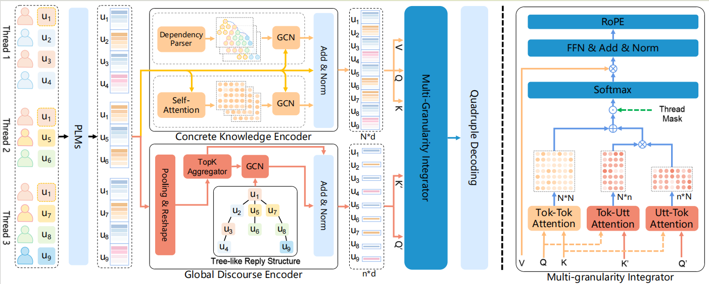

<!-- <p align="center"> -->
<!-- </p> -->
# DMIN
<a href="https://github.com/SIGSDSscau/DMIN">
  
</a>
<a href="https://github.com/SIGSDSscau/DMIN" rel="nofollow">
  
</a>
<a href="https://huggingface.co/docs/transformers/index" rel="nofollow">
  
</a>

This repository contains data and code for the ACL24 (findings) paper: [DMIN: A Discourse-specific Multi-granularity Integration Network for Conversational Aspect-based Sentiment Quadruple Analysis](https://aclanthology.org/2024.findings-acl.966/).

------

To clone the repository, please run the following command:

```bash
git clone https://github.com/SIGSDSscau/DMIN
```

## News 🎉

:loudspeaker: `2024-6-30`: Released the readme.

:zap: `2024-6-30`: Created repository.  


## Quick Links
- [Overview](#overview)
- [Requirements](#requirements)
- [Data Preparation](#data-preparation)
- [Model Usage](#model-usage)
- [Citation](#citation)


## Overview
In this work, we propose a fresh and effective framework for DiaASQ, which aims to extract Target-Aspect-Opinion-Sentiment quadruples from the given dialogue.
More details about the task can be found in our [paper](https://arxiv.org/abs/2211.05705).

<center>

</center>


## Requirements

The model is implemented using PyTorch. The versions of the main packages:

+ python>=3.7
+ torch>=1.8.1

Install the other required packages:
``` bash
pip install -r requirements.txt
```


+ GPU memory requirements 

| Dataset | Batch size | GPU Memory |
| --- | --- | --- |
| Chinese | 2 |  12GB. |
| English | 2 | 20GB. |

## TRAIN
### 1. Get Dataset
prepare data, dependency parse by spacy. You can download it from ```https://drive.google.com/drive/folders/1OJCOh6lyUny_5PkXq_qEUtHVf46PGqkL?usp=drive_link``` to ```data/dataset```;

OR

Download origin dataset from ```https://github.com/unikcc/DiaASQ/tree/master/data/dataset``` to data/dataset;

then install Spacy and download the model weight:
  - 'zh_core_web_trf' for ZH dataset
  - 'en_core_web_trf' for EN dataset

and you can get the dependency parse data by running the following code:
```
cd ./data/dataset/
python gen_dep_dataset_by_spacy.py
```


### 2. Training
```
# seed = 41-45
bash scrip/train.sh
```

## Citation
Our code and datasets are based on [DiaASQ](https://github.com/unikcc/DiaASQ). We appreciate the great help of this work.

If you use the dataset, please cite the following paper:
```
@article{lietal2022arxiv,
  title={DiaASQ: A Benchmark of Conversational Aspect-based Sentiment Quadruple Analysis},
  author={Bobo Li, Hao Fei, Fei Li, Yuhan Wu, Jinsong Zhang, Shengqiong Wu, Jingye Li, Yijiang Liu, Lizi Liao, Tat-Seng Chua, Donghong Ji}
  journal={arXiv preprint arXiv:2211.05705},
  year={2022}
}
```
